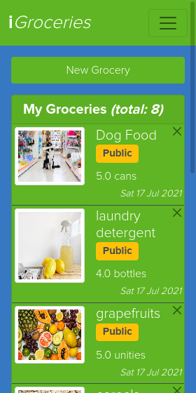

# iGroceries (RoR Module Capstone Project)

> This project was built for the [Microverse](https://www.microverse.org/) Ruby on Rails Module's Capstone Project and it is based on a mobile app for grouping payments by goal with the user's family/friends. The design followed the requirements provided by Microverse, but the content was personalized, for grouping the groceries a family or a collection of friends usually share. The idea was to create an MVP (Minimum Viable Product) for sharing a list of goods that matter to all users, as it is also possible for a user to create groceries out of any group, so that particular grocery wouldn't be shared amongst the other users.




This project followed the Test Driven Development (TDD) Principle, and 93 Tests were prepared in Rails: _44 Unit Tests_ for models associations and validations and _49 Integrations Tests_ for authentication and events managment, using Capybara [capybara 3.26 (Ruby Gem)] to control Selenium on Chrome Webdriver [selenium-webdriver 3.142.7 (Ruby Gem)] and RSpec [rspec-rails 5.0 (Ruby Gem)].

**Important**: As a project's requirement, the user logs in to the app, only by typing the username (a proper authenticated login is _not_ a requirement)

## Built With

- Ruby 3.0.1
- Rails 6.1.4 (Ruby Gem)
- PostgreSQL 12.7
- Bootstrap 5

## Live Demo

[Live Demo Link](https://stormy-stream-83904.herokuapp.com/)

## Getting Started

To get a local copy up and running, please follow these steps:

### Prerequisites

For this project, the following environment should be previously installed on your machine:

- Ruby 3.0.1
- Rails 6.1.4
- PostgreSQL 12.7
- Node 14.17.0
- Yarn 1.22.10

### Setup

- Go to your terminal bash and, on any directory of your preference, run

```sh
git clone git@github.com:enionsouza/igroceries.git
```

- Next, to go into the project root directory, run

```sh
cd igroceries
```

- To install all Ruby Gems this project requires, run

```sh
bundle install
```

- And, finally, to prevent any issue that might eventually come up because of webpacker package, run

```sh
rails webpacker:install
```

_Important Remark: In this steop, if you're requested to solve a conflict about `config/webpacker.yml`, please choose **not to overwrite** this file! Kindly type **n** and hit `<ENTER>`, on your keyboard._

### Install

- To migrate the databases needed for this project, run

```sh
rails db:create
rails db:migrate
```

- Optionally, you can load some record samples for Users, Groups, and Groceries Tables. To do it, simply run

```sh
rails db:seed
```

By doing this, you will get 5 sample users (named **'User001'**, **'User002'**, **'User003'**, **'User004'**, and **'User005'**), 12 sample groups, and 54 sample groceries. Please, note that, no password is required for user login.

- To start your local host, run

```sh
rails server
```

You can stop your local server pressing `<ctrl> + c` on your keyboard.

- On the browser of your preference, you can go to http://127.0.0.1:3000/ and set it to mobile view format. Now, you can either "Login" with one of the previously added users (see list above) or you can "Signup" with a new user with the "Signup" link.

- Bellow, it is presented an schema of the Databased used in this project:

        Users
          has_many :groups
          has_many :groceries
          - name:string

        Groups
          belongs_to :user
          has_and_belongs_to_many :groceries
          - name:string
          - icon:string
          - user:references

        Groceries
          belongs_to :author
          has_and_belongs_to_many :groups
          - author:references (to users)
          - name:string
          - amount:decimal(5,2)
          - unit:string

  

### Tests

- Please, make sure that your computer has Google Chrome installed, before performing these tests.
- On the root of the project, simply run

```sh
rspec
```

Some of the tests are run by Capybara, so you'll see a Chrome tab flashing through pieces of the web application. This is a bot running tests as if it were a user. Don't try to close this window.

## Author

👤 **Ênio Neves de Souza**

- GitHub: [@enionsouza](https://github.com/enionsouza)
- Twitter: [@enionsouza](https://twitter.com/enionsouza)
- LinkedIn: [Enio Neves de Souza](https://www.linkedin.com/in/enio-neves-de-souza/)

## 🤝 Contributing

Contributions, issues, and feature requests are welcome!

Feel free to check the [issues page](https://github.com/enionsouza/igroceries/issues).

## Show your support

Give a ⭐️ if you like this project!

## Acknowledgments

- [Microverse](https://www.microverse.org/)
- [The Odin Project](https://www.theodinproject.com/)
- [Rails Guides](https://guides.rubyonrails.org/index.html)

## 📝 License

This project is [MIT](./LICENSE) licensed.
